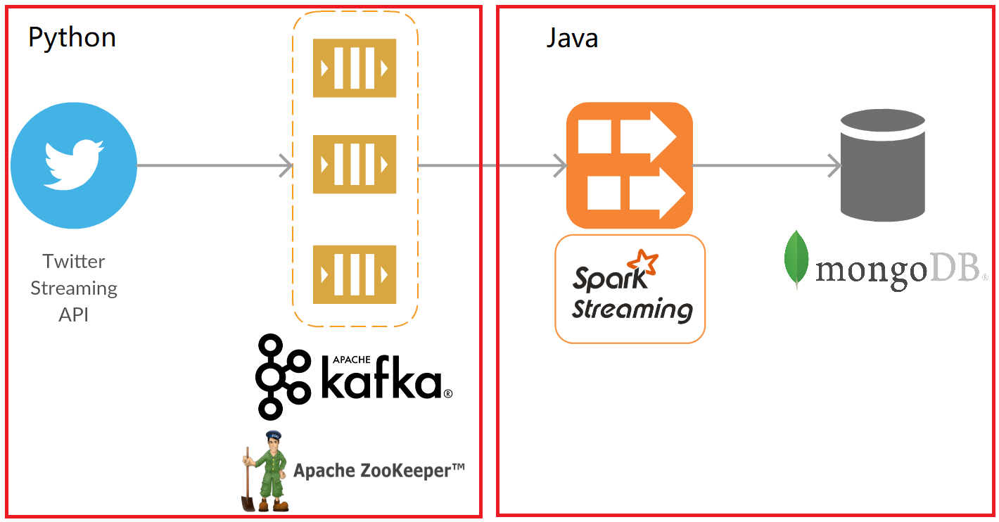

# Twitter streaming collection

## Introduction

In this project I implemented a data pipeline to stream real-time Twitter tweets. I used tweep, a python library, to access to Twitter streaming API and Kafka as my distributed queuing service. For streaming processing I choosed Spark and the finally the filtered and stored data will be stored in MongoDB.

## Environments

In order to access to [Twitter Streaming API ,](https://developer.twitter.com/en/docs/tutorials/consuming-streaming-data) we  need to apply our own four keys: Consumer Key, Consumer Secrect, Access Token and Access Token Secret via https://dev.twitter.com/apps/new, more information about it can be found from [Twitter Developer Site](https://developer.twitter.com/en/docs/authentication/oauth-1-0a/obtaining-user-access-tokens) .

There are some tools need to be installed before running the project:

##### 1. mongoDB

MongoDB is a very powerful NoSQL database and suitable for this project as the data stored in mongoDB is in JSON format which is also the one Twitter API used for its data. And I assume that the project will be running on a distributed system, mongoDB offers manay benefits for integration with Spark or other distributed processing technologies.  

You can download mongoDB from [mongoDB compass](https://www.mongodb.com/try/download/compass), and follow the installation instruction on https://docs.mongodb.com/manual/installation/, assume that you create your mongoDB's dbpath at `/usr/local/var/mongodb` and logpath at `/usr/local/var/log/`, then you can run the command in your terminal to start it:

`$ mongod --dbpath /usr/local/var/mongodb --logpath /usr/local/var/log/mongodb/mongo.log --fork`

The default port number is `27017`

##### 2. Kafka

Apache Kafka is a distributed streaming platform, I choose Kafka as my produce-consume messaging system to reliably get data between pipeline components. Tweets are received and published to one topic in the Kafka brokers, and eventually consumed by subscribers.

You can download Kafka from https://kafka.apache.org and install and run it as a [quick start](https://kafka.apache.org/07/documentation.html) . Also you can google for more information about how to config it, I will not list them due to a time-limit. As Kafka is using Apache Zookeeper as its distributed services, you need to start zookeeper service first:

`$ {KAFKA_HOME}/bin/zookeeper-server-start.sh config/zookeeper.properties`

Then start kafka service at your terminal:

`$ {KAFKA_HOME}/bin/kafka-server-start.sh ../config/server.properties`

The default listen port for Kafka is `2181` 

##### 3. Spark

Spark is a fast big data processing engine and supports a rich set of highr-level tools including Spark SQL for structured data processing, MLlib for machine learning and Spark Streaming. In this project I used Spark to consume and process the streams of data from Kafka and then write to MongoDB.

Similar as Kafka installation process, you can download the package from https://spark.apache.org/downloads.html, I would recommand to download the package with pre-built hadoop one, it will save your time to config both Hadoop and Spark. To install it at once, simply run the command in your terminal:

`$ {SPARK_HOME}/sbin/start-all.sh`

By default you can access the web UI for the master at port `8080`

The project is run and compied on macOS Big Sur ver. 11.2.1, following is the software with the version I used for this project: 

|        Tools        |          Ver          |
| :-----------------: | :-------------------: |
|       Python        |          3.7          |
|    Pycharm (IDE)    |        2020.3         |
|        Java         |         JDK8          |
| IntelliJ IDEA (IDE) |        2020.2         |
|    Apache Kafka     |   Kafka_2.11-1.1.1    |
|    Apache Spark     | Spark-2.1.1-hadoop2.7 |
|       mongoDB       |        1.25.0         |

## Workflow

This project is consisting of two main parts: on the Python side the program is receiving stream data from Twitter API and publishing it via Kafka; on the  Java side the program is Spark streaming the messages from Kafka, processing them based on the requirements and storing them into mongoDB.

##### Python

###### stream Tweets

I choose `tweepy` as my python library for the Twitter API. By using it I can stream real-time tweets and filter to only return Tweets based on keywords (in this proof-of-concept the ketword is "Justin Bieber"), language (set as English in this POC), location, etc. 

###### messaging

After filtering with keyword, the individual tweets objects streamed from this API are in JSON format.  I use `kafka` as my broker to produce the message contained this JSON format string in UTF-8 encoding. For this POC, I just choose one producer is working and the topic number is also one. The required python packages and versions are listed as:

|   Packages   |  Ver   |
| :----------: | :----: |
| Kafka-python | 2.0.2  |
|    Tweepy    | 3.10.0 |

##### Java

I am using `Spark Streaming+Kafka` integration for streaming and processing data between Kafka and Spark, and using `Spark Streaming+mongodb` integration for processing and storing data between Spark streaming and mongodb. The most important component behind Spark is RDD(Resilient Distributed Datasets), Spark can parallelly process these RDDs in its cluster. As the main data processing types Spark supports batch processing and parallel processing. In both of these methods, Spark uses RRD as the underline data structure. 

###### Spark streaming

I use RDD to process Spark streaming once Kafka consumer receive messages. In this POC the producer and consumer are running locally, I set master nodes as `SparkConf.setMaster("local[*]")` to run locally with as many cores as it can. In each RDD I will count the accumulated number of tweets it consumed and check if the tweet is having to do with **music.** The **total number** of consumed tweets will be displayed on-the-fly. Due to the time-limit I just simply hard code some key words related to music like `music`, `song`, `singer`, etc. If the tweet contains one or more keywords, then it will be **filtered out**. According to the requirement it is not clear that should I keep or remove those music related tweets, it is not technically problem but the result will be totally different. I am saving the tweets which is not related to music based on my assumption. One better idea is to analyze the semantic of the tweet to see if it is really related to some certain area. Due to the time-limit I am not considering to implement a better key words dictionary or semantic analysis like NLP on this POC, it can be done in the further if it's needed. 

###### store data

JSON may be the most popular data-interchange format over the whole internet, however the nested JSON might have very complex structure and not so firendly for structured schema. As we need the dataset for ML purpose in the furtue, I choose [json-flattener](https://github.com/wnameless/json-flattener) to flatten the JSON format object before storing into database. For demonstration purposes I created one database and one collection on mongoDB and all the processed data will be stored into it. 

To check if the tweet is **duplicated**, there might have several different definitions about it, we can say two users retweet the same original tweet is duplicated, or the two tweets are talking about the same thing is duplicated. I am just applying the duplicate checker for one simple scenario, that the contents of the tweets are exactly the same. That might happened in some distributed environment like Kafka consumer received redundant message from producer or consumer didn't send back the receipt for some reason then producer resend the redundant message. According to this case, "user id + created timestamp" is a good choice for indicating unique id of each tweet. As mongodb is generating a unique id `_id` for each document, I replaced it with my new combined id for each tweet (or we call it document).

I am using one simple but not very effective way to do "if  not exists then insert" by `db.collection.updateOne()`. Every time the new coming document will be compared with the existing collection, if it is not existed, then it will be inserted into the current collection. Another better idea might be maintaining a temp hashtable for each tweets in some certain size and expired time, then we can compare it with new record to see if it's duplicated. Again it is not implemented in the current POC due to the time-limit.

The final step of the RDD is to count the **unique number** of the tweets, I am using `db.collection.estimatedDocumentCount()` to get the result as the collection only contains unique post-processed tweets. It is a compromised way for this POC when the size of data streaming and collection is relatively small but for a high volumn data streaming or large scale dataset it is a time-consuming process as everytime it will parse the whole collection to get the count, another better solution is to maintain a counter to record this kind of record. 

The information about java dependencies and related versions can be found in the pom file. To compile the java code and run it, you can download or import the source code and run maven command:

`$ mvn clean install`

This POC does not have QA testing, UAT and PROD stage which should be included in production-ready solution.

Here is the architcture overview of this POC:

## Questions

#### What are the risks involved in building such a pipeline?

A typical data pipeline could be divided into the several components from source to destination:

1. Source

   The place where a pipeline extracts data from. The source should be accessible to guarantee the pipeline is producible.  And the pipeline should be reproducible in the case of the integration with different source data API. For example, one company is using SOAP APIs and another one is using REST APIs, or the marketing team is using Salesforce and product team is relying on mongoDB, it is important for pipeline to be flexible to fetch data from different sources.

2. Dataflow

   The movement of data from source to destination. During this transportation, data will be transformed, processed and cleaned up. One main purpose of a data pipeline is collecting data for data analysis, data mining and machine learning. Sometimes incomplete or redundant data will bring troubles in data analysis. A monitoring mechanism should be applied to check for data accuracy and data consistent, particularly as the size of data grows larger. 

   Flexibility is also needed to be concerned, for example, changes in API might result in unexpected characters that the pipeline hasn't handled in the past. 

3. Destination

   The endpoint for the data pipeline is also important. One risk is the target schemas are not matching source or streaming data, or some databases are not optimized for real-time processing. Another potential issue is some database infrastructure cannot support the increasing data volumes and the evolution of data sources.

   Overall, the challenges/risks in building a pipeline might include: accuracy, scalability, reproducibility, consistent and reliability.

#### How would you roll out the pipeline going from proof-of-concept to a production-ready solution?

- What would a production-ready solution entail that a POC wouldn't?

  Production-ready solution is when a system or a major update can be introduced into **production**, and **ready** always means it is stably running on production environment and satisifying the current project requirements. For a typical POC, it provides a prototype to demonstrate to reflect the real-world scenario. POC is usually used by developer to examine if the requirements are valid, and it does not intend to release. POC is very useful for the early stages in the development life cycle, it can save months of code by proving if an idea is valid, but it's still lacking of most of key performance aspects like security, reliability, maintainability, usability which production-ready solution should have. The POC's functionality is limited and is only focusing on the aspects to be proved — which is way **less** than the full product. 

  Production-ready solution should be well documented for maintenance and the ability to scale.  But when it comes to a POC, documentation is not as important as production-ready's. As POC is often a "quick and dirty" demonstration of some idea, it typically has a short life-cycle and will not be as large as the full product.  Last but not least, Good user experience which is highly concerned in production-ready solution will also be ignored in POC in most of the cases.

  Overall, A POC is far away from production-ready solution.
